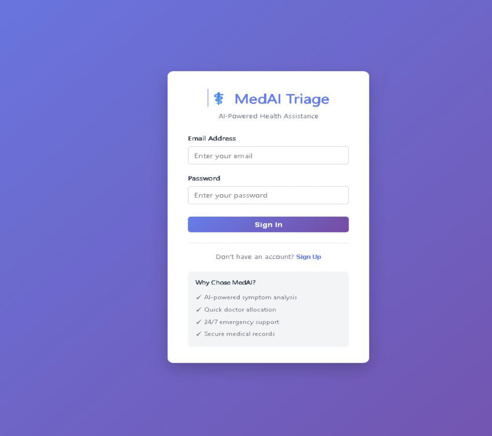
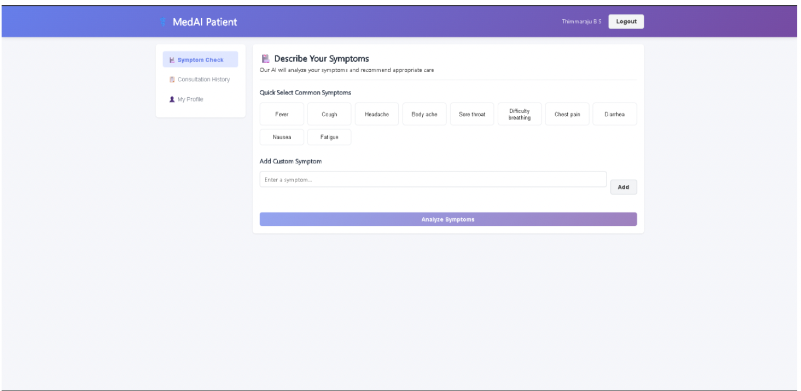
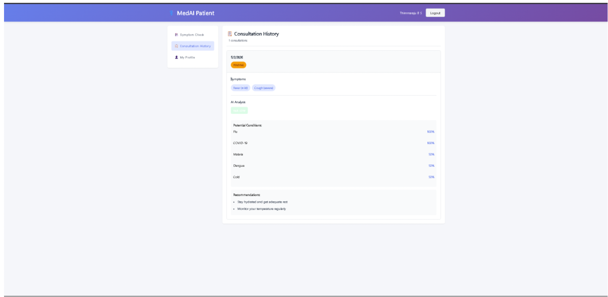
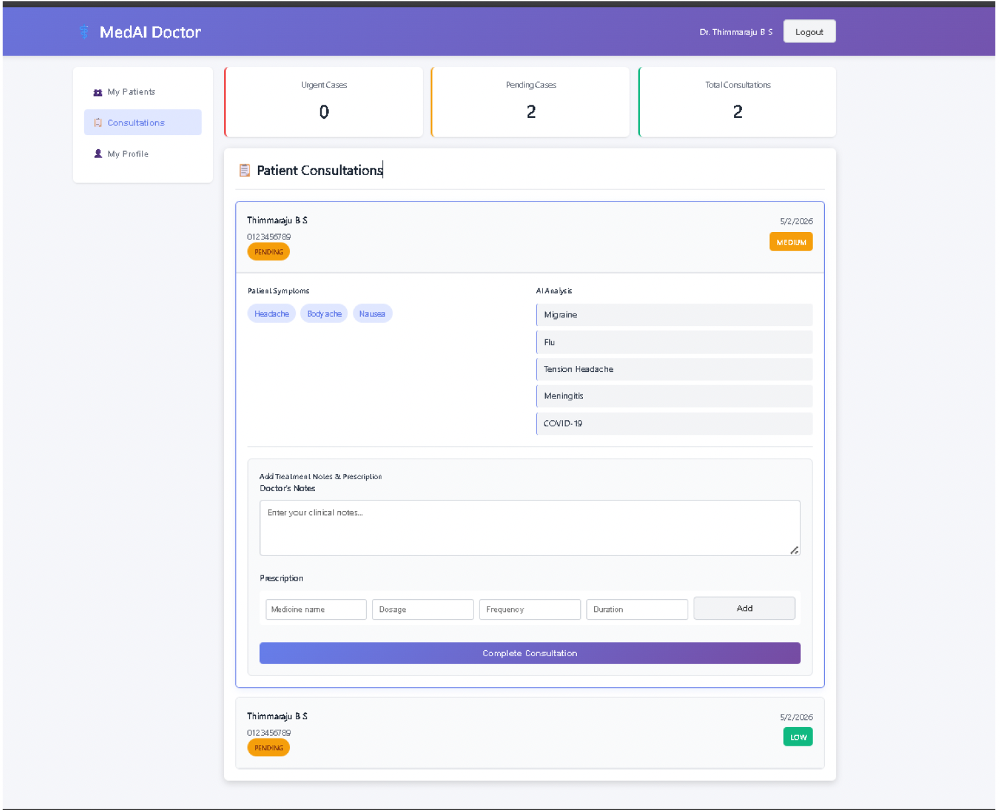
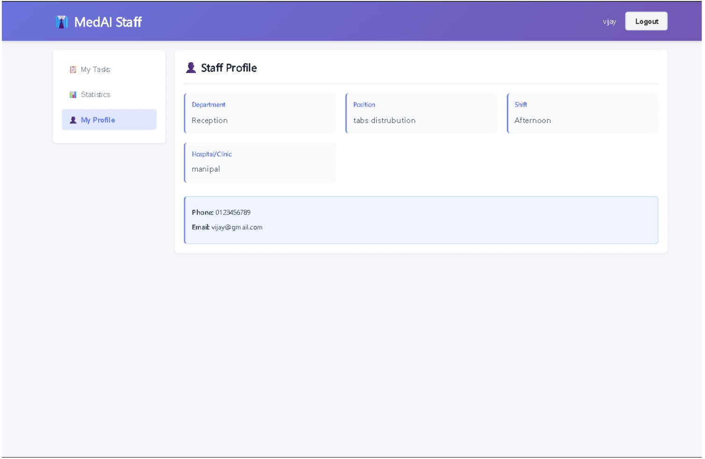

# MedAI - AI-Based Symptom Triage & Smart Doctor Allocation System

A comprehensive MERN stack application for healthcare management with AI-powered symptom analysis and intelligent doctor allocation.

## Features

### For Patients
- 🏥 AI-powered symptom analysis
- 🚨 Emergency detection and alert system
- 👨‍⚕️ Automatic doctor allocation based on symptoms
- 📋 Consultation history tracking
- 💊 Prescription management
- ⭐ Rate doctors and consultations
- 👤 Medical profile management

### For Doctors
- 👥 View assigned patients
- 📋 Manage patient consultations
- 💊 Write prescriptions
- 📝 Add clinical notes
- ⭐ Track patient ratings
- 📊 Consultation statistics

### For Staff
- 📋 Task management system
- 📅 Schedule timings and patient visits
- 🔄 Track task progress
- 📊 Performance statistics
- ⏰ Due date tracking

## Tech Stack

### Backend
- **Node.js** - Runtime environment
- **Express.js** - Web framework
- **MongoDB** - Database
- **Mongoose** - ODM library
- **JWT** - Authentication
- **bcryptjs** - Password hashing

### Frontend
- **React** - UI library
- **React Router** - Navigation
- **Axios** - HTTP client
- **CSS3** - Styling

## Project Structure

```
fullstack ai/
├── backend/
│   ├── models/              # Mongoose schemas
│   │   ├── User.js
│   │   ├── Patient.js
│   │   ├── Doctor.js
│   │   ├── Staff.js
│   │   ├── Consultation.js
│   │   └── Task.js
│   ├── controllers/         # Business logic
│   │   ├── authController.js
│   │   ├── consultationController.js
│   │   ├── doctorController.js
│   │   ├── staffController.js
│   │   └── patientController.js
│   ├── routes/              # API endpoints
│   │   ├── authRoutes.js
│   │   ├── consultationRoutes.js
│   │   ├── doctorRoutes.js
│   │   ├── staffRoutes.js
│   │   └── patientRoutes.js
│   ├── middleware/          # Custom middleware
│   │   └── auth.js
│   ├── utils/               # Helper functions
│   │   └── helpers.js
│   ├── server.js            # Entry point
│   ├── package.json
│   └── .env.example
│
└── frontend/
    ├── public/
    │   └── index.html
    ├── src/
    │   ├── components/       # Reusable components
    │   │   ├── SymptomForm.js
    │   │   └── ConsultationHistory.js
    │   ├── pages/            # Page components
    │   │   ├── AuthPage.js
    │   │   ├── PatientDashboard.js
    │   │   ├── DoctorDashboard.js
    │   │   └── StaffDashboard.js
    │   ├── context/          # Context API
    │   │   └── AuthContext.js
    │   ├── services/         # API services
    │   │   └── api.js
    │   ├── styles/           # CSS files
    │   │   ├── global.css
    │   │   ├── authPage.css
    │   │   ├── patientDashboard.css
    │   │   ├── symptomForm.css
    │   │   ├── consultationHistory.css
    │   │   ├── doctorDashboard.css
    │   │   └── staffDashboard.css
    │   ├── App.js
    │   └── index.js
    ├── package.json
    └── .env.example
```

## Installation & Setup

### Prerequisites
- Node.js (v14+)
- npm or yarn
- MongoDB (local or cloud)

### Backend Setup

1. Navigate to backend directory:
```bash
cd backend
```

2. Install dependencies:
```bash
npm install
```

3. Create `.env` file from `.env.example`:
```bash
cp .env.example .env
```

4. Update `.env` with your configuration:
```
PORT=5000
MONGODB_URI=mongodb://localhost:27017/symptom-triage
JWT_SECRET=your_jwt_secret_key_here
JWT_EXPIRE=7d
NODE_ENV=development
```

5. Start the server:
```bash
npm start
# or for development with auto-reload
npm run dev
```

### Frontend Setup

1. Navigate to frontend directory:
```bash
cd frontend
```

2. Install dependencies:
```bash
npm install
```

3. Create `.env` file from `.env.example`:
```bash
cp .env.example .env
```

4. Update `.env` if needed:
```
REACT_APP_API_BASE_URL=http://localhost:5000/api
```

5. Start the development server:
```bash
npm start
```

The application will open at `http://localhost:3000`

## API Endpoints

### Authentication
- `POST /api/auth/register` - Register new user
- `POST /api/auth/login` - Login user
- `GET /api/auth/profile` - Get user profile

### Consultations
- `POST /api/consultations/create` - Create new consultation
- `GET /api/consultations/patient` - Get patient consultations
- `GET /api/consultations/doctor` - Get doctor consultations
- `GET /api/consultations/:id` - Get consultation details
- `PUT /api/consultations/:id/status` - Update consultation status
- `PUT /api/consultations/:id/prescription` - Add prescription
- `PUT /api/consultations/:id/rating` - Rate consultation

### Doctors
- `GET /api/doctors/list` - Get all doctors
- `GET /api/doctors/specialization/:specialization` - Get doctors by specialization
- `GET /api/doctors/profile` - Get doctor profile
- `GET /api/doctors/patients` - Get doctor's patients
- `PUT /api/doctors/profile` - Update doctor profile

### Patients
- `GET /api/patients/profile` - Get patient profile
- `PUT /api/patients/profile` - Update patient profile
- `POST /api/patients/medical-history` - Add medical history

### Staff
- `GET /api/staff/tasks` - Get assigned tasks
- `PUT /api/staff/tasks/:id/status` - Update task status
- `GET /api/staff/profile` - Get staff profile
- `GET /api/staff/tasks/stats` - Get task statistics
- `POST /api/staff/tasks/:staffId/create` - Create task

## User Roles

### Patient
- Browse symptoms and get AI-based analysis
- Receive emergency alerts if needed
- Get automatic doctor allocation
- Track consultation history
- Rate doctors and consultations

### Doctor
- View assigned patients
- Manage consultations
- Write prescriptions and notes
- Track consultation metrics

### Staff
- Manage assigned tasks
- Schedule patient visits
- Track task progress
- View performance statistics

## AI Symptom Analysis

The system includes a built-in AI analyzer that:
- Maps symptoms to potential diseases
- Calculates probability scores
- Determines risk levels (LOW, MEDIUM, HIGH, CRITICAL)
- Detects emergency conditions
- Generates treatment recommendations
- Suggests appropriate specializations

## Key Features Implementation

### Symptom Analysis
```javascript
// Backend: utils/helpers.js
analyzeSymptomsAI(symptoms) -> {
  potentialDiseases,
  riskLevel,
  isEmergency,
  recommendations
}
```

### Doctor Allocation
- Automatic allocation based on symptom specialization
- Risk-based assignment (emergency cases prioritized)
- Load balancing among available doctors

### Task Management
- Create, update, and track tasks
- Priority levels (low, medium, high, urgent)
- Due date tracking
- Completion statistics

## Security Features

- JWT-based authentication
- Password hashing with bcryptjs
- Role-based access control (RBAC)
- Protected API routes
- Input validation

## Database Models

### User
- Base model for all users
- Authentication credentials
- contact information

### Patient
- Medical history
- Allergies & current medications
- Assigned doctor
- Emergency contact

### Doctor
- License & specialization
- Experience & qualifications
- Availability schedule
- Patient list & ratings

### Staff
- Department & position
- Shift information
- Assigned tasks
- Supervisor reference

### Consultation
- Symptom details
- AI analysis results
- Doctor assignment
- Prescription & notes
- Patient rating

### Task
- Task type & description
- Priority level
- Due date & status
- Patient & creator reference

## Usage Examples

### Patient Registration & Symptom Check
1. Register as patient
2. Enter symptoms on dashboard
3. AI analyzes and provides risk assessment
4. Doctor is automatically assigned if needed
5. View recommendations and assigned doctor info

### Doctor Workflow
1. Login to view assigned patients
2. Check pending consultations
3. Review patient symptoms & AI analysis
4. Add clinical notes
5. Write prescription
6. Mark consultation as completed

### Staff Task Management
1. View assigned tasks
2. Filter by status or priority
3. Update task progress
4. View completion statistics
5. Track upcoming and overdue tasks

## Future Enhancements

- Video consultation feature
- Appointment booking system
- Payment integration
- SMS/Email notifications
- Mobile app
- Advanced analytics dashboard
- Machine learning improvement
- Integration with medical devices
- Telemedicine platform
## Screenshots

### Login Page


### Patient Dashboard


### Consultation History


### Doctor Dashboard


### Staff Dashboard


## Support & Contact

For issues or questions, please contact the development team.

## License

MIT License - See LICENSE file for details

---

**MedAI - Transforming Healthcare with AI** 🏥💻
